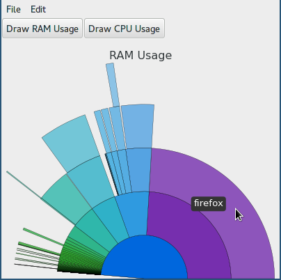

Visram
======

Visram is a graphical visualizer for one's RAM usage. It shows RAM (and CPU) usage per process via a nested pie chart. It is intended to be similar to the GNOME project's Baobab, but for CPU/RAM instead of disk usage. It is tested to work on Windows and Linux.

#Requirements
- Python2
- Matplotlib
- wxPython
- psutil

#Usage
`$ python2 app.py`
